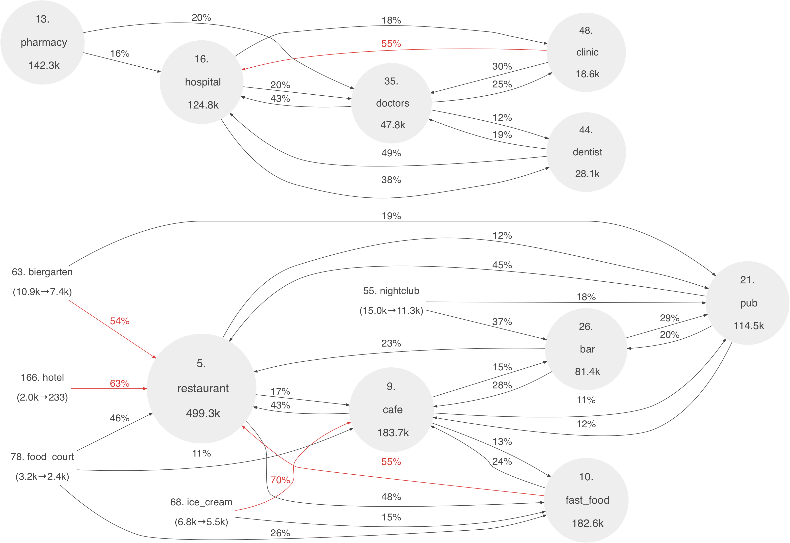

# osm-tag-dynamics
[This blog post](http://matiasdahl.iki.fi/2015/finding-related-amenity-tags-on-the-openstreetmap) describes a method for linking together related tags on the [OpenStreetMap](https://www.openstreetmap.org/). Using this method one can draw visualizations like the below:

 

(Image based on OSM data, (c) OpenStreetMap contributors. Used here under the [ODbL license](https://www.openstreetmap.org/copyright)).

The purpose of this repository is to provide the software tools necessary to make custom visualizations like the above. 

